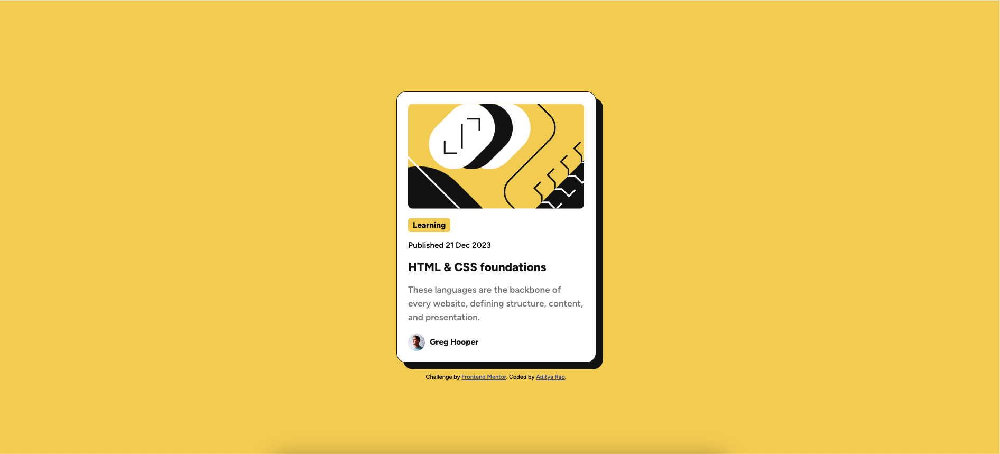

# Frontend Mentor - Blog preview card solution

This is a solution to the [Blog preview card challenge on Frontend Mentor](https://www.frontendmentor.io/challenges/blog-preview-card-ckPaj01IcS). Frontend Mentor challenges help you improve your coding skills by building realistic projects.

## Table of contents

- [Overview](#overview)
  - [The challenge](#the-challenge)
  - [Screenshot](#screenshot)
  - [Links](#links)
- [My process](#my-process)
  - [Built with](#built-with)
  - [What I learned](#what-i-learned)
  - [Continued development](#continued-development)
  - [Useful resources](#useful-resources)
- [Author](#author)

**Note: Delete this note and update the table of contents based on what sections you keep.**

## Overview

### The challenge

Users should be able to:

- See hover and focus states for all interactive elements on the page

### Screenshot

### Links

- Solution URL: [Github repository](https://github.com/thisisadityarao/FM-blog-preview-card)
- Live Site URL: [Hosted on Github Pages](https://thisisadityarao.github.io/FM-blog-preview-card/)

## My process

### Built with

- Semantic HTML5 markup
- CSS custom properties
- Flexbox
- Mobile-first workflow

### What I learned

Unlike the previous challenge (QR code component), I made use of **flexbox** for positioning and centering elements which made this challenge easier.

I learned how to use local fonts files with css. I also made use of **css custom properties** and [BEM](https://getbem.com/) naming convention.

I had to generate a modular type scale using one of the tools below for making font-size responsive or fluid. We make use of `clamp()` to set font-size.

### Continued development

I want to focus on improving my understanding of different font loading strategies, and creating and using a fluid type/space system for responsive design.

### Useful resources

- [utopia](https://utopia.fyi/type/calculator/) - This helped me create a fluid type scale. It's a powerful tool, which I need to explore more.
- [fluid-type-scale](https://www.fluid-type-scale.com/) - Another tool to create a fluid type scale.

## Author

- Website - [Aditya Rao](https://adityarao.netlify.app/)
- Frontend Mentor - [@thisisadityarao](https://www.frontendmentor.io/profile/thisisadityarao)
- Twitter - [@thisisadityarao](https://www.twitter.com/thisisadityarao)
